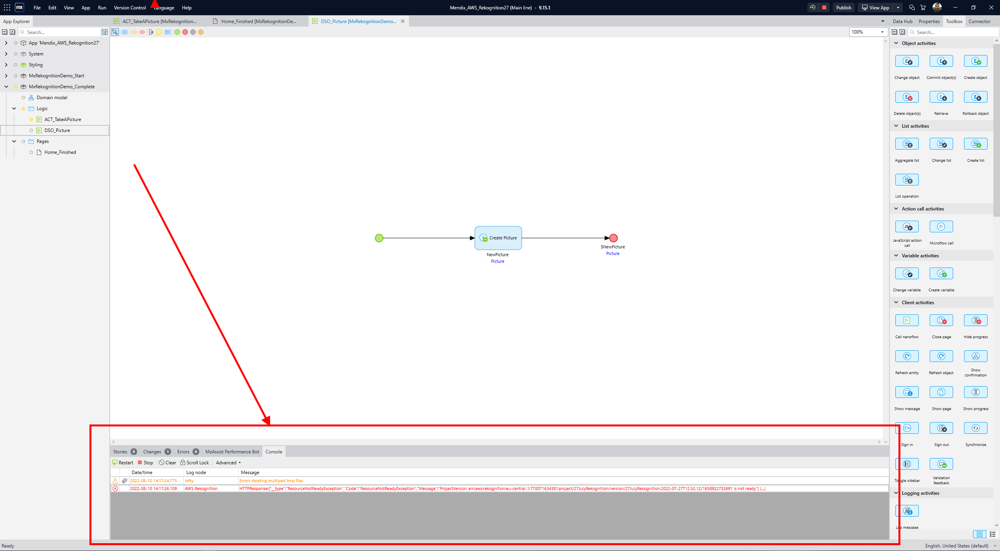
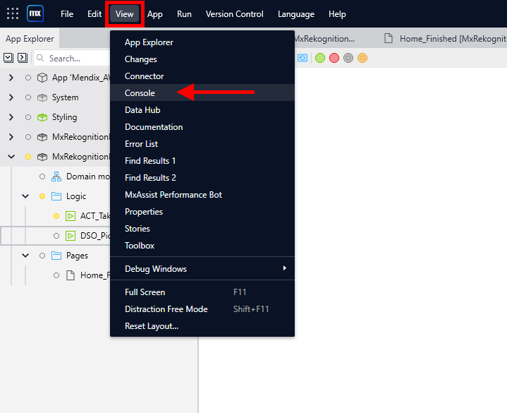
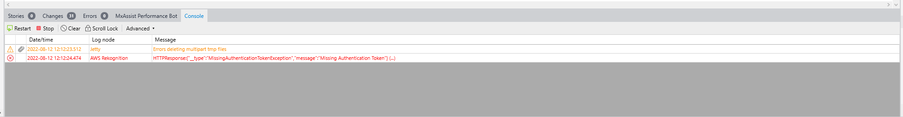
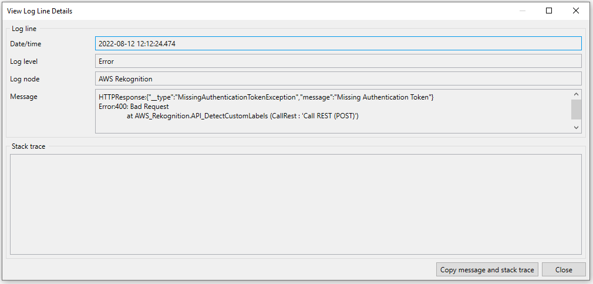
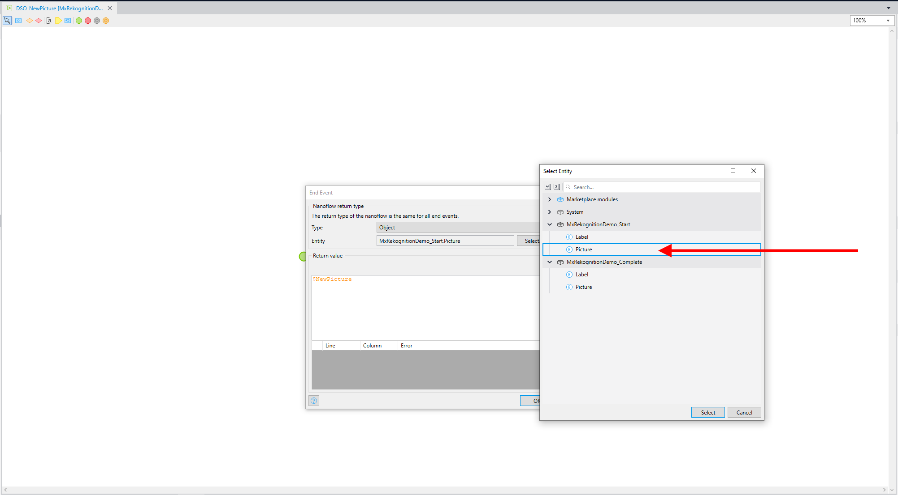

# Mendix AWS Rekoginition Frequently Asked Questions

- [Mendix AWS Rekoginition Frequently Asked Questions](#mendix-aws-rekoginition-frequently-asked-questions)
- [Feedback](#feedback)
- [Mendix](#mendix)
  - [What is Mendix?](#what-is-mendix)
  - [What is the difference between Studio and Studio Pro?](#what-is-the-difference-between-studio-and-studio-pro)
  - [Do I need a license for Mendix Studio Pro?](#do-i-need-a-license-for-mendix-studio-pro)
  - [How can I run my Mendix app?](#how-can-i-run-my-mendix-app)
- [AWS](#aws)
  - [What is AWS Rekognition?](#what-is-aws-rekognition)
  - [What are we using AWS Rekognition for?](#what-are-we-using-aws-rekognition-for)
- [General](#general)
  - [Can I re-use an existing bucket?](#can-i-re-use-an-existing-bucket)
- [Troubleshooting](#troubleshooting)
  - [An error has occurred](#an-error-has-occurred)
  - [No labels detected](#no-labels-detected)

Welcome to the Mendix AWS Rekognition Frequently Asked Questions

# Feedback
If you have a question that is NOT answered below, or if you have other feedback regarding the workshop, please feel free to get in touch with us [here](https://mendix.com)

# Mendix

## What is Mendix?

Mendix is a Low Code platform for the Enterprise that empowers teams to build better apps, faster. See [here](https://www.mendix.com/) for more

## What is the difference between Studio and Studio Pro?

Mendix Studio & Studio Pro are IDE environments provided by the Mendix platform and they both share the exact same, version-controlled, model.  

**Mendix Studio** is a Browser-based IDE used to help you model out your data, pages and logic & workflow in a nice drag and drop fashion and is designed for Business Users or Citizen developers with business expertise to model out their application.

**Mendix Studio Pro** is an IDE installed locally on your development machine and is aimed at pro developers who will need more power and more control over the application.  This IDE uses the same tools that Studio has, but with more control in terms of all the development aspecs such as Integration. Your Pro devs will make use of Mendix Studio Pro to develop more complex integrations into external systems. For example, in the case of this workshop, we are using it to connect our app to, and make use of, the AWS Rekognition service.

## Do I need a license for Mendix Studio Pro?

No, developing apps on Mendix Studio or Studio Pro is completely free - pricing starts to come into play when you are ready to run your app in a production or production-like environment for your business users or customers. See our [pricing](https://www.mendix.com/pricing/) for more

## How can I run my Mendix app?

You can run Mendix Studio Pro on your local machine for testing, but by default your app will have a free sandbox cloud environment attached to it that you can deploy to using the "Publish" button inside Mendix Studio Pro

# AWS

## What is AWS Rekognition?

Rekognition is a service for automating your image & video analysis with machine learning. 

Quickly add pre-trained or customizable computer vision APIs to your applications without building machine learning (ML) models and infrastructure from scratch.

Analyze millions of images, streaming, and stored videos within seconds, and augment human review tasks with artificial intelligence (AI).

Scale up and down based on your business needs with fully managed AI capabilities and pay only for the images and videos you analyze.

See [Rekognition](https://aws.amazon.com/rekognition/) for more

## What are we using AWS Rekognition for?

In this workshop we make use of Rekognitions's image offering called, "Custom Label Detection". This allows you to detect custom objects such as brand logos using automated machine learning (AutoML) to train your models with as few as 10 images.

# General

## Can I re-use an existing bucket?

Yes you can, you might need to modify your bucket policy however in [Create Dataset](README.md#create-dataset)

# Troubleshooting

## An error has occurred

In some cases, after taking a photo, you might see a pop-up that says, "An error has occurred". In this case it is a good idea to check the logs. To do this in Mendix Studio Pro you will use the "Console" tab at the bottom - see screenshot below

**Cannot see the console?**

If you can's see the console, you can enable it by using the View menu:

## No labels detected

If you take a picture and the page still shows no labels check the following:

1. Check the [Console](#an-error-has-occurred) for errors

You can **double click** on the error message to see more details

2. 400 Bad Request

One common error we've come across is a 400 Bad Request. This usually means your authentication Credentials are not setup correctly - make sure to check you've completed the instructions for [authentication](README.md#setting-your-aws-access-and-secret-keys-in-mendix)

2. Data Source not configured correctly

Check to make sure you have followed the instructions for setting your List View Data source in [Building the User Interface](README.md#building-the-user-interface) Step 23.

3. Wrong entity selected

Make sure that you have selected the correct **Picture** Entity when creating the Data Source Nanoflow. There is another Picture Entity inside the **MxRekognitionDemo_Complete** Module - this is so you can see how it should look

