# Mendix AWS Rekoginition Template

Welcome to the Mendix AWS Rekognition workshop! 

This workshop has been designed to help you get started with using Mendix and AWS Rekognition. It contains all the required modules to make it easy for you to build an app connected to AWS Rekognition. Once built the app will allow you to take a photo on your mobile phone or laptop, upload it to AWS Rekognition, and view the results of the Rekognition analysis. The template contains a start and complete module so that you can either decide to use the final solution or build your way up to the solution.

<b>This template already assumes that you have some knowledge of AWS, a AWS account, and a Mendix account</b>

You can signup for a free Mendix account for free here: [Sign Up for Free](https://signup.mendix.com/link/signup/?source=none&medium=aws-demo)

You can open an AWS Account and access AWS Free Tier Offers: [Learn more and Create a Free Account](https://aws.amazon.com/free/?all-free-tier&all-free-tier.sort-by=item.additionalFields.SortRank&all-free-tier.sort-order=asc&awsf.Free%20Tier%20Types=*all&awsf.Free%20Tier%20Categories=*all)

# Workshop Outline:

- [Mendix AWS Rekoginition Template](#mendix-aws-rekoginition-template)
- [Workshop Outline:](#workshop-outline)
  - [AWS Build](#aws-build)
    - [Amazon S3 Dataset](#amazon-s3-dataset)
    - [Amazon Rekognition](#amazon-rekognition)
      - [Create S3 Bucket when prompted](#create-s3-bucket-when-prompted)
      - [Create Project (console)](#create-project-console)
      - [Create Dataset](#create-dataset)
      - [Label Images](#label-images)
      - [Train Model](#train-model)
      - [Evaluate](#evaluate)
      - [Use Model](#use-model)
  - [Mendix Setup](#mendix-setup)
    - [Windows Setup](#windows-setup)
    - [Mac or Non-Windows Setup - Launch windows EC2 Instance with Mendix Studio Pro Installed](#mac-or-non-windows-setup---launch-windows-ec2-instance-with-mendix-studio-pro-installed)
    - [Download release from this repo](#download-release-from-this-repo)
  - [Setup your project](#setup-your-project)
  - [The Mendix Build](#the-mendix-build)
    - [Creating your AWS Keys](#creating-your-aws-keys)
    - [Security Policy for Rekognition](#security-policy-for-rekognition)
    - [Setting your AWS Access and Secret Keys in Mendix](#setting-your-aws-access-and-secret-keys-in-mendix)
    - [Setting up the Rekognition constants](#setting-up-the-rekognition-constants)
    - [Building the domain model](#building-the-domain-model)
    - [Building the User Interface](#building-the-user-interface)
    - [Building the logic](#building-the-logic)
- [Bonus 1](#bonus-1)
  - [Change your app and use it to detect celebrity faces!](#change-your-app-and-use-it-to-detect-celebrity-faces)
- [Bonus 2](#bonus-2)
  - [Publish messages using AWS IoT Core & MQTT](#publish-messages-using-aws-iot-core--mqtt)
    - [Setup your IoT Core thing](#setup-your-iot-core-thing)
    - [Build for Publishing messages](#build-for-publishing-messages)
    - [Test your publishing](#test-your-publishing)
    - [Build for Subscribe](#build-for-subscribe)
    - [Test Subscribe](#test-subscribe)
- [Clean up](#clean-up)
  - [Amazon Rekogniton Clean up](#amazon-rekogniton-clean-up)
  - [Amazon S3 Clean up](#amazon-s3-clean-up)
  - [Amazon EC2 Clean up](#amazon-ec2-clean-up)
- [Frequently Asked Questions (FAQ)](#frequently-asked-questions-faq)
- [Troubleshooting](#troubleshooting)
- [Your feedback](#your-feedback)

## AWS Build

### Amazon S3 Dataset
The image dataset used in the webinar is available here: [Cars.zip](https://s3.eu-central-1.amazonaws.com/mendixdemo.com/aws/cars.zip) Download and unzip folder.

1.	Sign in to the AWS Management Console and open the Amazon S3 console at https://console.aws.amazon.com/s3/.
2.	Choose Create bucket.

**IMPORTANT: AWS accounts have a 100 bucket limit by default: [Bucket restrictions](https://docs.aws.amazon.com/AmazonS3/latest/userguide/BucketRestrictions.html)**

The Create bucket wizard opens.

3.	In Bucket name, enter a DNS-compliant name for your bucket. For example *mendixcars-yourname*
4.	In Region, choose the AWS Region where you want the bucket to reside.
Choose a Region close to you to minimize latency and costs and address regulatory requirements. Validate that Amazon Rekognition service is available in that region.
5.	Leave other settings as default, scroll down and click **Create bucket** button.
6.	Select a new bucket. You should be able to upload the entire **Cars** folder by dragging and dropping it to upload or sync the folder with your local files using the AWS CLI. 
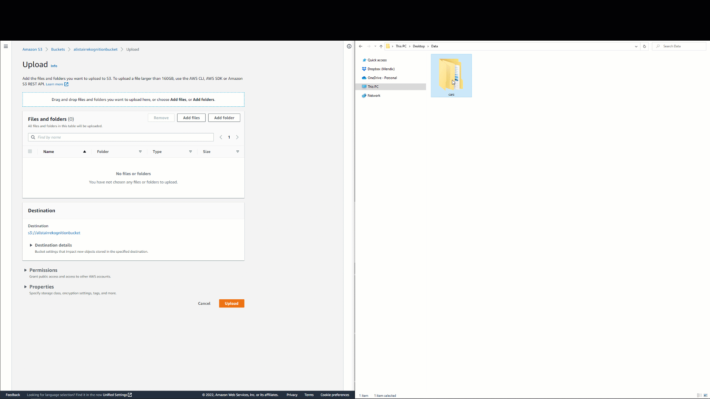
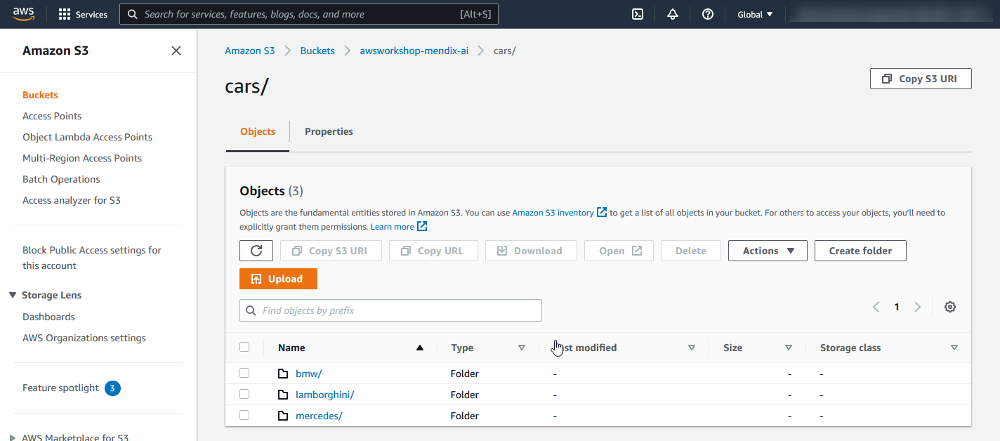


7. If you decide to use AWS CLI, make sure you configire credentials by following instructuins outlined in the [AWS documentation](https://docs.aws.amazon.com/cli/latest/userguide/cli-chap-configure.html). 


Note: AWS Config and role should have permission for Rekognition. Check an IAM User that is used in AWS CLI Config. Create a group in IAM such as *PerformActionToRekognition*. Attach **AmazonRekognitionFullAccess** policy to group. Add your IAM user to the newly created group.

8. After you configured AWS CLI then navigate to the folder that contains *cars* folder and use S3 sync command:

```aws s3 sync . s3://mybucket```


Note: make sure that you upload "cars" folder to the bucket.


8. Open the [IAM console](https://console.aws.amazon.com/iam/)
9. In the navigation pane of the IAM console, choose **Roles**, and then choose **Create role**.
10. For **Select trusted entity**, choose **AWS service**.
11. From Use Case  search **Rekognition**. Use cases are defined by the service to include the trust policy required by the service. Then, choose **Next**.

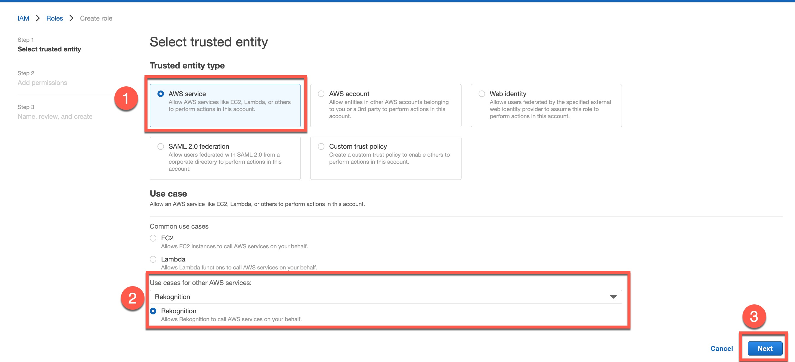

12. Give role name such as *Mendix_Rekog_To_S3*. Review information and click **Create role**.
13. Once the role is created, find it in the search bar and drill down into it

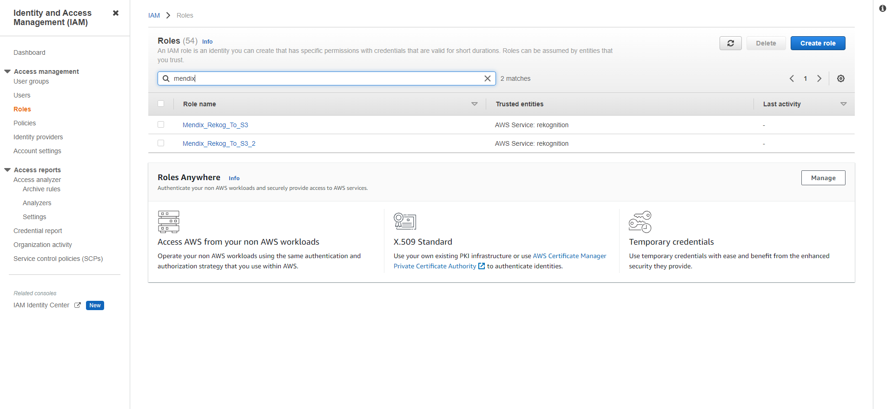

14. Make sure to copy the ARN using the copy icon and keep this for later steps

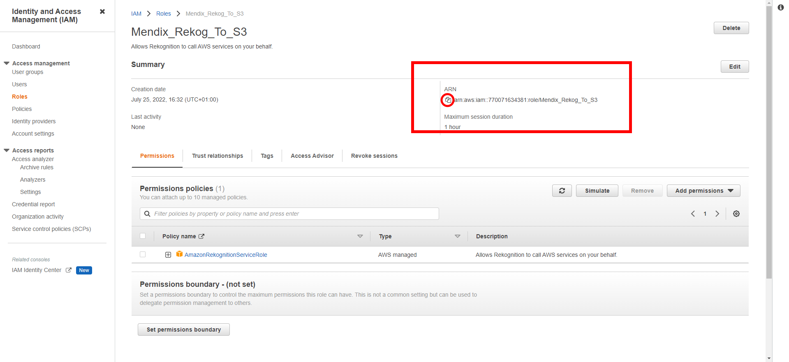


### Amazon Rekognition


With Amazon Rekognition Custom Labels, you can identify the objects and scenes in images that are specific to your business needs. For example, you can find your logo in social media posts, identify your products on store shelves, classify machine parts in an assembly line, distinguish healthy and infected plants, or detect animated characters in videos.

No machine learning expertise is required to build your custom model. Rekognition Custom Labels includes AutoML capabilities that take care of the machine learning for you. Once the training images are provided, Rekognition Custom Labels can automatically load and inspect the data, select the right machine learning algorithms, train a model, and provide model performance metrics.

Rekognition Custom Labels builds off of Rekognition’s existing capabilities, which are already trained on tens of millions of images across many categories. Instead of thousands of images, you simply need to upload a small set of training images (typically a few hundred images or less) that are specific to your use case into our easy-to-use console. If your images are already labeled, Rekognition can begin training in just a few clicks. If not, you can label them directly within Rekognition’s labeling interface, or use Amazon SageMaker Ground Truth to label them for you. Once Rekognition begins training from your image set, it can produce a custom image analysis model for you in just a few hours. Behind the scenes, Rekognition Custom Labels automatically loads and inspects the training data, selects the right machine learning algorithms, trains a model, and provides model performance metrics. You can then use your custom model via the Rekognition Custom Labels API and integrate it into your applications.

In this example, we will train to analyze car makers and damages.

#### Create S3 Bucket when prompted

The first time you use Rekognition in a region, it will prompt you to create an S3 bucket to store your project files
1. Click **Create S3 bucket**


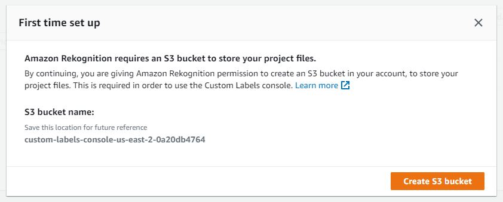

#### Create Project (console)
1.	Sign in to the AWS Management Console and open the Amazon Rekognition console at https://console.aws.amazon.com/rekognition/
2.	In the left pane, choose **Use Custom Labels**. The Amazon Rekognition Custom Labels landing page is shown.
3.	The Amazon Rekognition Custom Labels landing page, choose to **Get started**. In the left pane, **Choose Projects**. 
4.	Choose a Region close to you to minimize latency and costs and address regulatory requirements.
5.	Choose **Create Project**.
6.	In Project name, enter a name for your project. For example *mendixcars*
7.	Choose **Create project** to create your project.

#### Create Dataset

1.	Choose **Create dataset**. The Create dataset page is shown.
2.	In Starting configuration, choose **Start with a single dataset**


3.	Choose Import images from Amazon S3 bucket.
4.	In S3 URI, enter the Amazon S3 bucket location and folder path. Select a parent *cars* folder that contains folders: *bmw, mercedes, lamborghini* and click Copy S3 URI.


5.	Choose Automatically attach labels to images based on the folder.
6.	Choose Create Datasets. The datasets page for your project opens.


7.	Scroll down and copy the policy provided.  In a new tab, open the S3 console and select your bucket with images. 


8.	On **Permissions** tab scroll down to **Bucket policy** and click edit and paste the policy. 

**IMPORTANT: Make sure to delete any leading whitespace after pasting**


9. Change the principal from *rekognition.amazonaws.com* service to the ARN of role created in Step 12 of previous section. Click Save changes to save policy update. In each instance of
```
"Principal": {
  "Service" : "rekognition.amazonaws.com"
}
```

with 

```
"Principal": {
  "AWS" : "arn:aws:iam::<insert role ARN details>"
}
```

**There will be FOUR instances that need to be replaced**


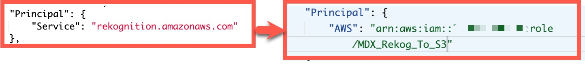

10.	Go back to Amazon Rekognition configuration, click **Create Dataset** in Rekognition console. Depending on the number of images, it might take a few minutes to create a dataset.

#### Label Images
1.	You can review images in the dataset and validate automatically assigned labels.
2.	In the image gallery, select on the left pane **Labeled** and use check boxes to review images of cars.

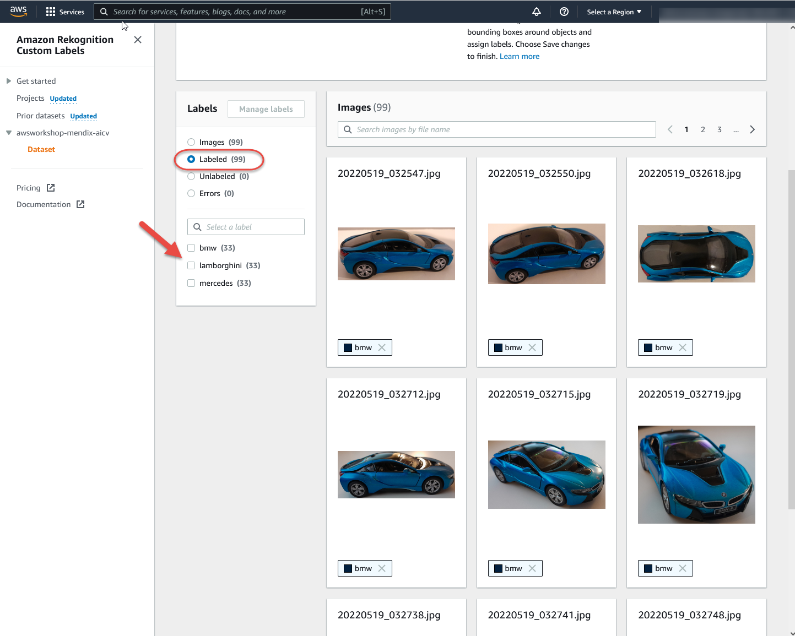

#### Train Model
1.  On the Project page, choose **Train model**.


2.  Keep default settings and click **Train model**. Depending on a number of images it will take from 30 minutes to 24 hours. 
Note: 200 images takes about 40 minutes. You don't have to wait for model completion please proceed to the next section.


3. Check on Status 


4. What do we do while we wait!? While your model is training, feel free to start with the steps starting at [Mendix Setup](#mendix-setup)


#### Evaluate
1.	In the Models section of the project page, you can check the current status in the Model Status column, where the training's in progress.

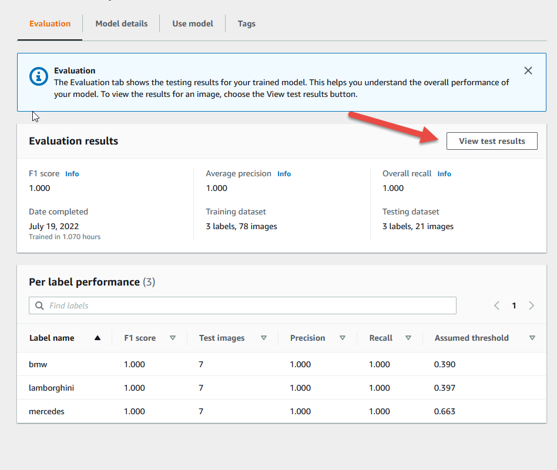

After your model is trained, Amazon Rekognition Custom Labels provides the following metrics as a summary of the training results and as metrics for each label: Precision, Recall, F1.

2.  If you are interested in how your model performed on test images Choose View test results to see the results for individual test images. For more information, see [Metrics for evaluating your model](https://docs.aws.amazon.com/rekognition/latest/customlabels-dg/im-metrics-use.html).

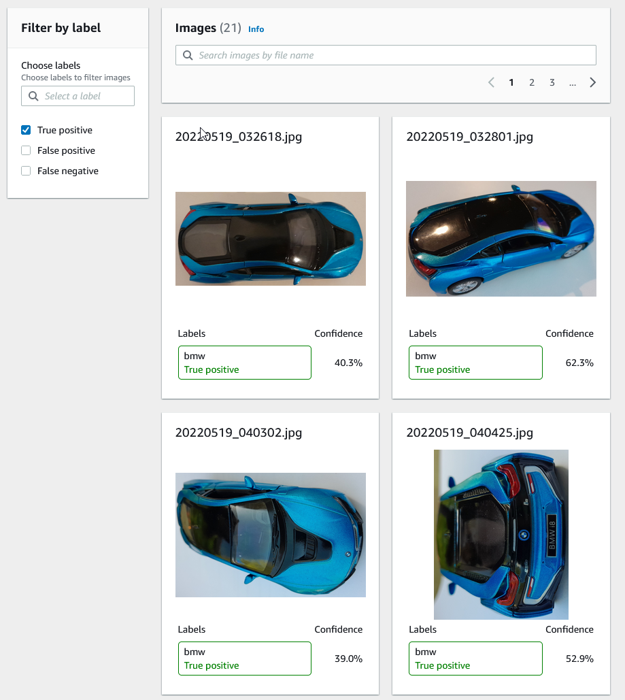


#### Use Model
1.	In the Start or stop model section select the number of inference units that you want to use. For more information, see [Running a trained Amazon Rekognition Custom Labels model](https://docs.aws.amazon.com/rekognition/latest/customlabels-dg/running-model.html).
2.	Choose **Start**. In the Start model dialog box, choose **Start**.
3.	In the Model section, check the status of the model. When the model status is RUNNING, you can use the model to analyze images. 


4. You can test your model using AWS CLI command.

```aws rekognition detect-custom-labels --project-version-arn "your model arn" --image "S3Object={Bucket=mendixcars, Name=car.jpg}" --region us-west-2```

5. Replace the information in yellow with details of your model and a bucket containing new images for analysis.

## Mendix Setup

We will be using Mendix Studio Pro to develop our app, which requires a Windows Operating system. If you don't have Windows installed, follow the below instructions for [Launching a Windows machine on EC2](#mac-or-non-windows-setup---launch-windows-ec2-instance-with-mendix-studio-pro-installed)

### Windows Setup

If you are using a Windows machine, all you will need to do is download & Install Mendix Studio Pro

1. Download the latest Mendix Studio Pro from the [Marketplace](https://marketplace.mendix.com/link/studiopro/)
2. Install this onto your machine (this will require some administrative privileges)

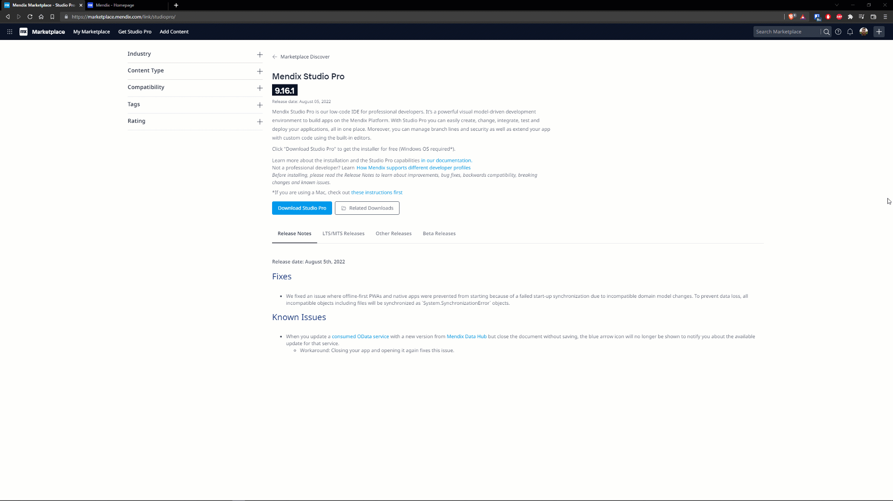

Now this is done, you can jump to [Download release from this repo](#download-release-from-this-repo)

### Mac or Non-Windows Setup - Launch windows EC2 Instance with Mendix Studio Pro Installed

We have published a Cloudformation Template that you can easily launch which is an EC2 Instance with an AMI that contains Mendix Studio Pro already installed. If you have Windows, you can skip to [Download release from this repo](#download-release-from-this-repo)

**This is a temporary solution, Mendix Studio Pro will be released on Mac in the near future**

**IMPORTANT: The region where you spin up the EC2 Instance can be different from where you create your Rekognition model**

1. In order for the Cloudformation process to work you first need to create a EC2 Keypair. This can be created by searching for EC2 in the AWS Console, clicking on keypairs and creating a new one.

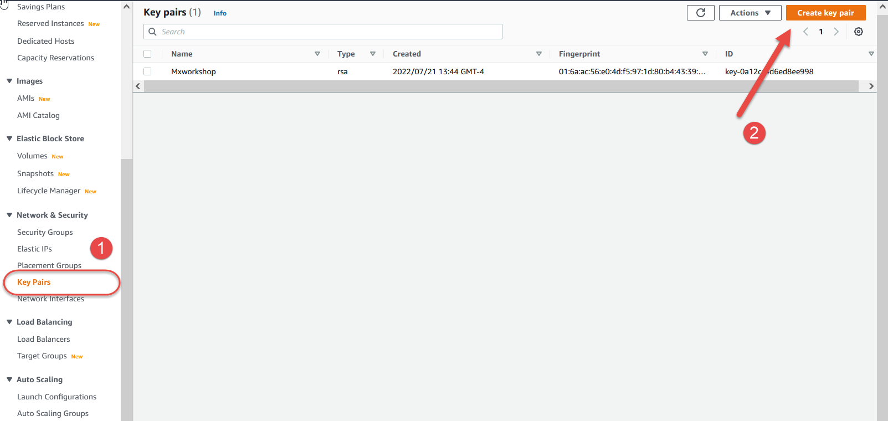

2. The Key pair dialog box will open, give it a name and select the PEM option.


3. Click create key pair, which will generate you a key in PEM format and download to your computer. You will need this key pair to successfully run the Cloud Formation process.

4. When you have the Key Pair you can launch the cloud formation template:

[](https://console.aws.amazon.com/cloudformation/home?region=eu-central-1#/stacks/new?stackName=MendixStudioPro-Windows&templateURL=https://mendix-aws.s3.eu-central-1.amazonaws.com/cf1.json)

5. In the cloudformation steps select the newly created keypair under the keyname option.

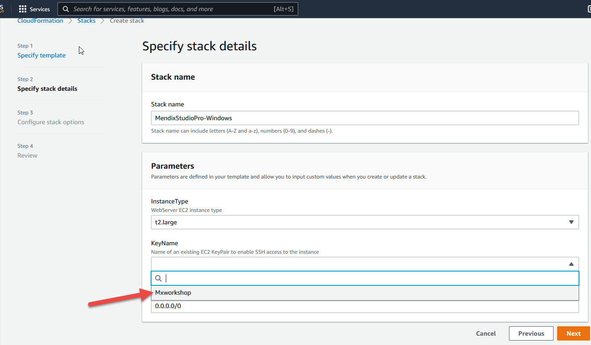

6. Use the default values for all the other steps during the cloud formation process. Once your cloudformation script has complete you'll have a new EC2 instance provisioned with everything you need to build your Mendix app.

7. Once the stack is created open EC2 from the AWS Console. Click on Instances, find your newly created instance, and click on the instance id.

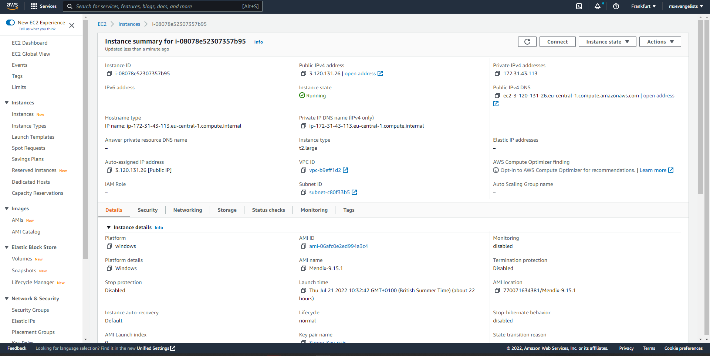

8. Click on **Connect** in the top right of the instance overview. Select on the option **RDP client**.

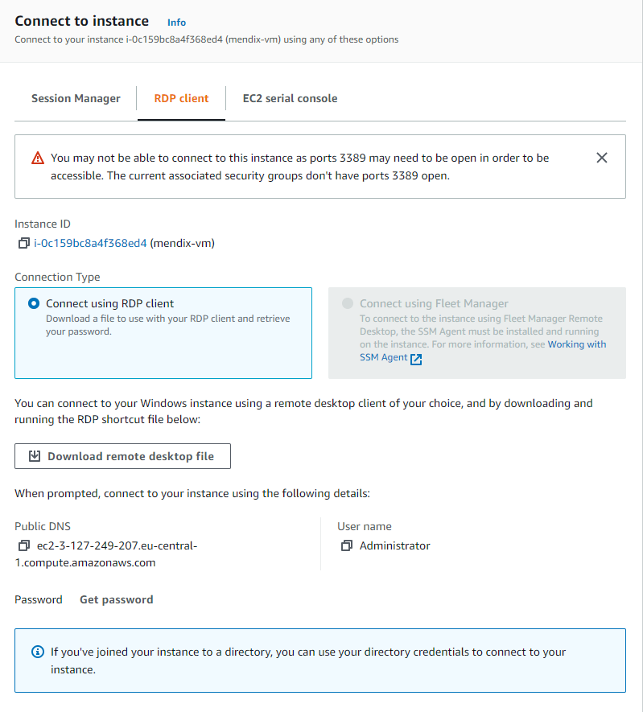

9. Download the remote desktop file.

10. Next Click on **Get password**. This password you will need to login via RDP to the windows desktop.

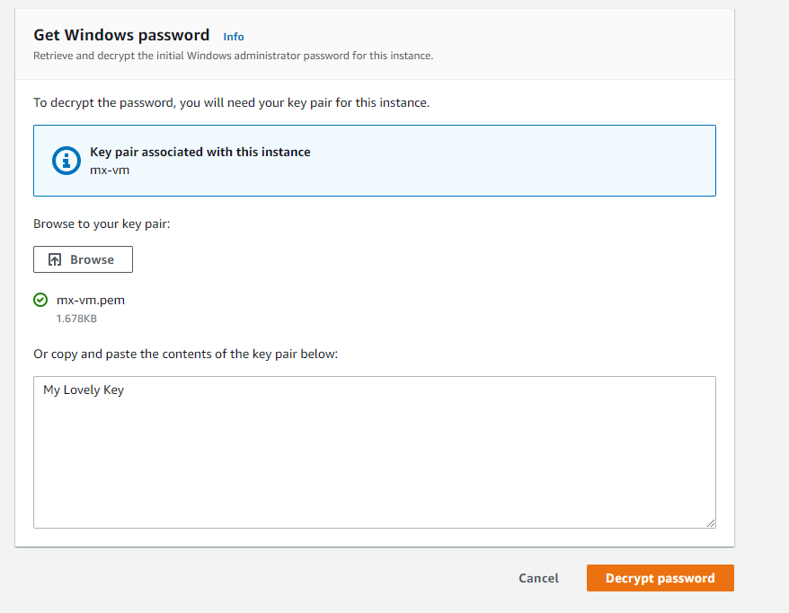

11. Upload your pem key pair file that you created earlier and hit **Decrypt Password**. You'll see that this dialog will close and your password will appear on the previous page. Copy the password.

12. Run the RDP file that you downloaded earlier and paste the password into the dialog when prompted.

You should now see your windows desktop with Mendix installed. 

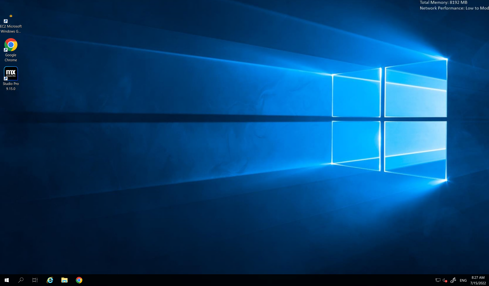

### Download release from this repo

1. Once you have your Windows OS setup, download the latest release from this github repo, you will then have the starter Mendix App that you will be working in

[Download MPK](https://github.com/mxcrawford/Mendix-AWS-Rekognition/releases/tag/v1.0)

<a href="https://github.com/mxcrawford/Mendix-AWS-Rekognition/releases/tag/v1.0">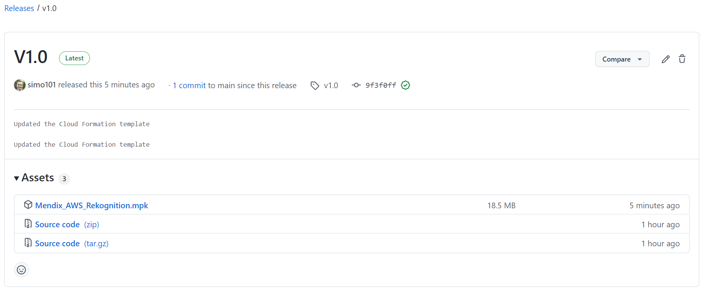</a>

## Setup your project

1. Once you have the ```Mendix_AWS_Rekognition.mpk``` package downloaded, open Mendix Studio Pro from the Desktop.

2. Sign in with the account details you setup signing up for Mendix.

3. Import the Project package in order to create your own project

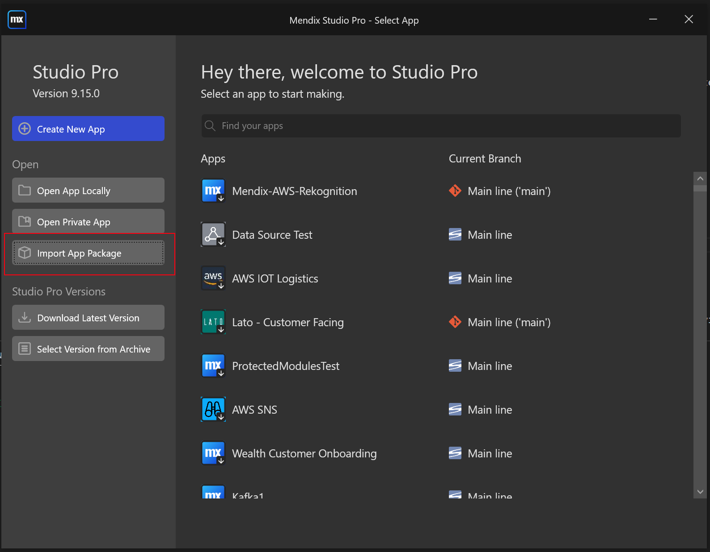

4. Next, select your choice of version control and location of your project - for this exercise it is recommended to use SVN which Mendix uses in the developer portal. Select **New Mendix Teamserver**

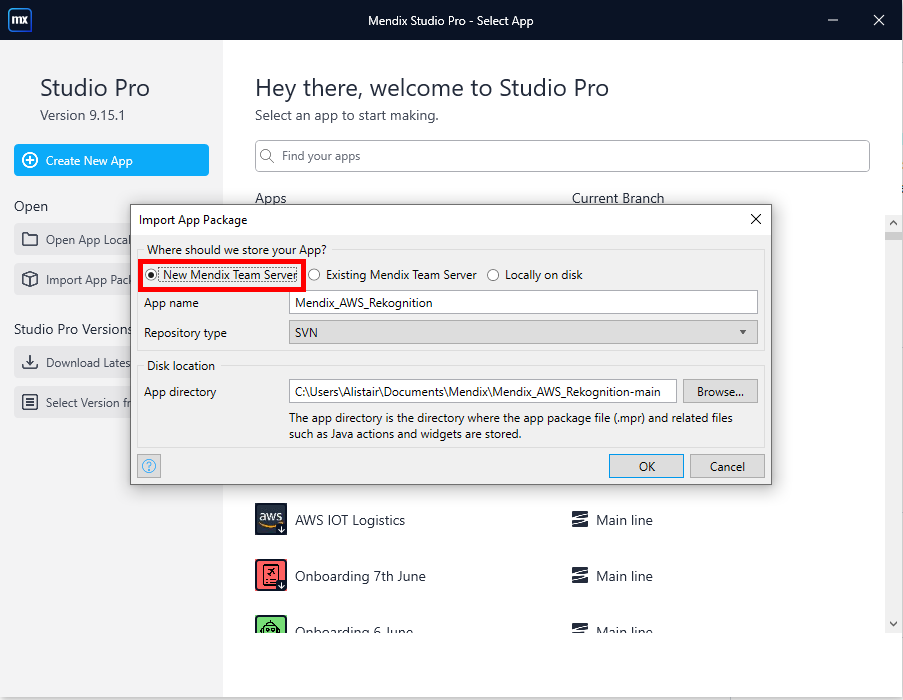

The project will now be created and uploaded to the repository

## The Mendix Build

In order to connect to AWS Rekognition it's important that you set up a number of constants. These constants are environment variables needed to make sure that the app can connect to the right AWS service using your AWS credentials.

### Creating your AWS Keys
To generate an AWS Access and Secret Key follow the steps below: 
1. [Create an IAM Admin](https://docs.aws.amazon.com/rekognition/latest/customlabels-dg/su-account-user.html)
2. [Create Access Keys](https://docs.aws.amazon.com/rekognition/latest/customlabels-dg/su-awscli-sdk.html)

### Security Policy for Rekognition
To keep it simple you can use stronger credentials, but in order to interact with the model ONLY, the following policy example can be used and modified:

```
{
    "Version": "2012-10-17",
    "Statement": [
        {
            "Sid": "VisualEditor0",
            "Effect": "Allow",
            "Action": "rekognition:DetectCustomLabels",
            "Resource": "arn:aws:rekognition:<INSERT_REGION>:<account id>:project/<project-name>/version/*/*"
        }
    ]
}
```

### Setting your AWS Access and Secret Keys in Mendix
In order to authenticate with AWS services, it's important that requests are signed using an AWS access and secret key. In Mendix this is done using the Sig4 process. Inside this application, we have already included a module to help with this process.
1. Create access and secret key pair on AWS with access to Rekognition service.
2. Copy each of the keys.
3. With the application open inside Studio Pro expand the Marketplace modules folder item in the app explorer.
4. Then expand the AWS_Sig4 module.
5. Finally, double click on the Access Key ID and Secret Key then paste the values into each.


### Setting up the Rekognition constants
The Rekognition module has two constants that need to be set to ensure that the APIs can communicate with the pre-built Rekognition model. These are:
1. AWS_HostPattern - This should be the URL of the endpoint that the API is calling, this will be different depending on the AWS region used for Rekognition. The endpoint URLs can be found here: https://docs.aws.amazon.com/general/latest/gr/rekognition.html. MAKE SURE TO INCLUDE THE https://

The URL of the rekognition endpoint is usually in this format: 
```https://rekognition.{aws-region}.amazonaws.com```. But this will be slightly different if you're running from US Gov Or FIPS Cloud.

2. AWS_Region - This should be set to the region where the Rekognition AI model is deployed. The regions can be found here: https://docs.aws.amazon.com/general/latest/gr/rekognition.html

These constants can be found inside the AWS_Rekognition module in the marketplace folder. Then open up the constants folder:


Once you have these constants set up you're ready to begin your build.

### Building the domain model
The first step with many Mendix projects is to start with building the data structure. Data is modeled in Mendix using domain models. Each Module in Mendix contains a domain model where you can model the entities, associations and attributes. Follow the below steps to build out the right structure. These instructions assume that you have already pre-installed Mendix Studio Pro 9.12.2+.

1. Using the App Explorer on the left-hand side open up the module **MxRekognitionDemo_Start**.
2. Double click on the **Domain model**. 
3. Drag an **Entity** from the *Toolbox* onto the *Canvas*. The *Toolbox* can be often found on the right-hand side.


4. Double click on the **Entity** to open the dialog box.
5. Change the **Name** to *Picture*


6. Click the **Select** button next to **Generalization**
7. In the Search field type *Image*


8. Double click on the **Image** entity.
9. Click the **OK** button at the bottom to close the dialog.
10. Drag another **Entity** onto the workbench.


11. Double click on this **Entity** and rename it to *Label*
12. Under the **Attributes** tab click the **New** button.
13. Name your first attribute **Name**.
14. Click **OK** to close the dialog.
15. Add another Attribute and call this one **Confidence**.
16. Under the Data Type Dropdown select **Decimal**.


17. Click **OK** and then **OK** to close both dialogs.
18. Associate the two entities by dragging the arrow **from** *Label* **to** *Picture*. This will create a relationship between these two entities.


### Building the User Interface
1. Open up the folder **Pages** inside the **MxRekognitionDemo_Start** module.
2. Double click on **Home_Start** to open up.
3. From the right-hand side open up the **Toolbox** and then select **Building Blocks** tab.


4. Search and Drag the Block labeled **Label Block** to the bottom empty space.
5. Drag the other building block **Picture Block** to the space above.


Now to give these widgets some data context, we will create a new instance of the Picture entity/object that we will use to:
1. Take a picture with and store the image in
2. Show the Label data that we receive from Rekognition that is associated with our picture (This is why we connected the Label and Picture Entity together in the Domain Model in our previous steps)

3. We need to tell the page the context object that we plan to work with (of type Picture) and for this we use a **Data View** and connect this up to our Picture object that we created in the Domain Model. Click on the **Widgets** tab on the right-hand side.
4. Drag on a **Data view** widget onto the page at the top.


8. Double click on the Date View widget to open up the properties dialog.
9. Under **Data source** section, Select Type: **Nanoflow**. You can find more information on Nanoflows here: [Nanoflows](https://docs.mendix.com/refguide/nanoflows/)

Our Nanoflow will allow us to create a new Picture context object to do what we need to do, every time the page loads

10. Click the **Select** button.


11. Click the **New** button at the bottom of the popup.
12. Give the Nanoflow a name like *DSO_NewPicture*. You can find more information on naming conventions here: [Best practices](https://docs.mendix.com/howto/general/dev-best-practices/#341-entity-event-microflows)


13. Click the **Show** button to open up the nanoflow and close the dialog.


14. Using the Toolbox drag on a **Create Object** action.


15. Double click on the action and set the entity type to our new **Picture** entity.


16. Double click on the **Endpoint** represented by a red dot. 
17. Configure it to return an **Object** 


18. Set the value to the newly created Object $NewPicture. You can click Ctrl + Space and select it from dropdown. 


19. Click File -> Save All.

This Nanoflow is now complete, and we can move onto our next step

20.  Open up the **Home_Start** page again.
21.  Drag the entiere existing layout into the Dataview.


22. Double click on the Picture *control* and connect it to the Picture *entity*.

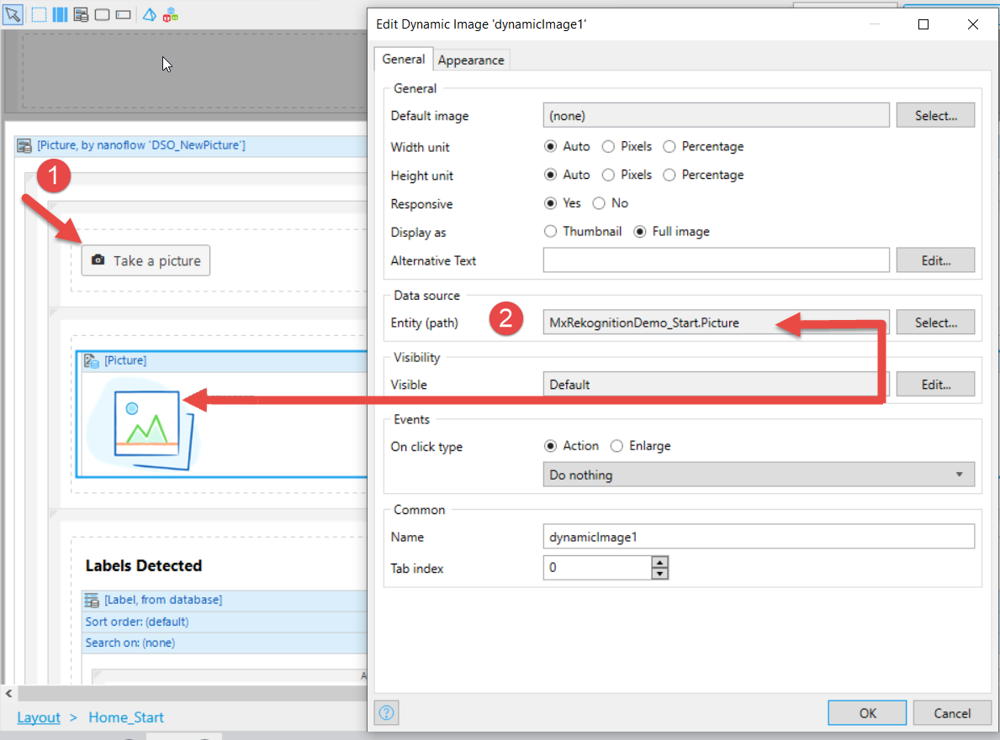

23. Double click on the **List view**. Select **Data source** tab. Next to **Entity (path)** click **Select** and pick entity *Label*

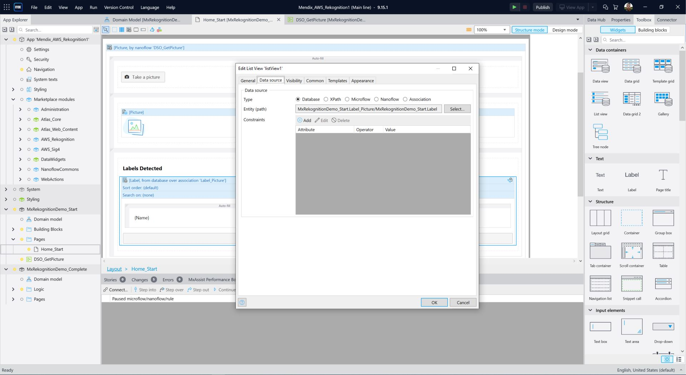

**Select NO when asked to automatically fill the contents**

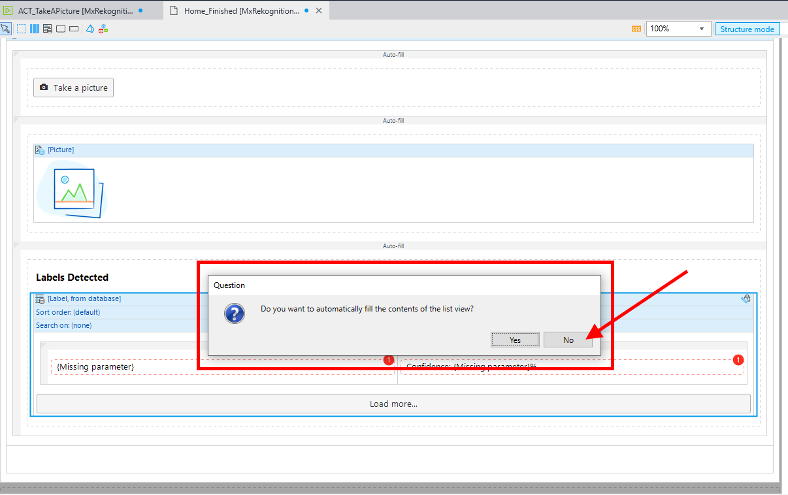

24. Configure the left parameter in the ListView by double-clicking on the **Text item**, then use then connect Parameter {1} up to **Name**.
Caption: {1}
Parameter type: Attribute path
Attribute path: MxRekogniitonDemo_Start.Label.Name
mx-build-page-listview-autogenerate.jpg


25. Configure the right parameter in the ListView by double-clicking on the **Text item**, then use then connect Parameter {1} up to **Confidence**.


### Building the logic
Logic in Mendix is defined using Microflows for server-side logic and Nanoflows for client-side. Both of these concepts use the same modeling paradigm. Allowing you to define logic using actions, decisions and loops.

To perform the logic needed we'll create a Nanoflow which will open up the camera, save the picture, process it by Rekognition, and save the results. Here are the steps:

1. Right-click on the **Take a picture** button and click **Edit on click action**.
2. Select from the dropdown **Call a Nanoflow**.
3. Click the **New** button.
4. Enter the name *ACT_TakePicture* and click **OK**.


5. Open up the newly built Nanoflow.
6. Drag and Drop from the Toolbox a **Take Picture** action. The box has to be in the middle of an arrow as on the screenshot.


7. Double-Click on the **Detect Custom Labels** Activity box to Configure the parameters as follows:
    - Picture = $Picture
    - Show Confirmation Screen = false
    - Picture Quality = low
    - Maximum width = empty
    - Maximum height = empty


8. From the Toolbox drag the detect custom labels action and configure as follows:
    - ProjectARN = Your Rekognition ARN. 
    Copy paste your Rekognition model.
    
    **Make sure to include single quotes when inserting a text/string value**

Example:

    ```
    'arn:aws:rekognition:us-west-2:123456:project/awsworkshop-mendix-aicv/version/awsworkshop-mendix-aicv.2022-07-19T11.24.01/1658244241480'
    ```

    - Image = $Picture
    - MaxResults = 10
    - MinConfidence = 0
    - AWS_Region = your region.
    Press *Control + Space* and type *AWS_Rekognition.AWS_Region.* and select your region.

    Lastly, the Detect Custom Labels action returns a list of labels, make sure to give it a clear name


9. Drag a **Loop** activity from the **Toolbox** to the microflow and connect it to the CustomLabel List.


10. Inside the loop drag a **Retrieve** action from the **Toolbox** to retrieve the **BoundingBox**.
11. Connect up the retrieve action by double-clicking on the action, selecting **By association**, clicking **Select**, and selecting the **Bounding Box** association.


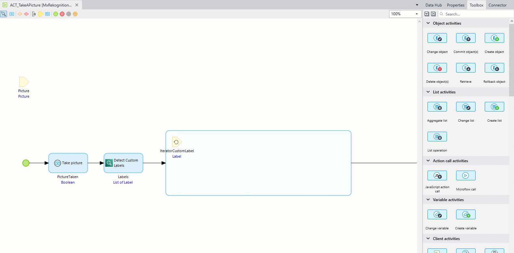


12. Drag on a **Create Object** action from the **Toolbox** into the loop and draw a line from the bounding box to the "Create" action.

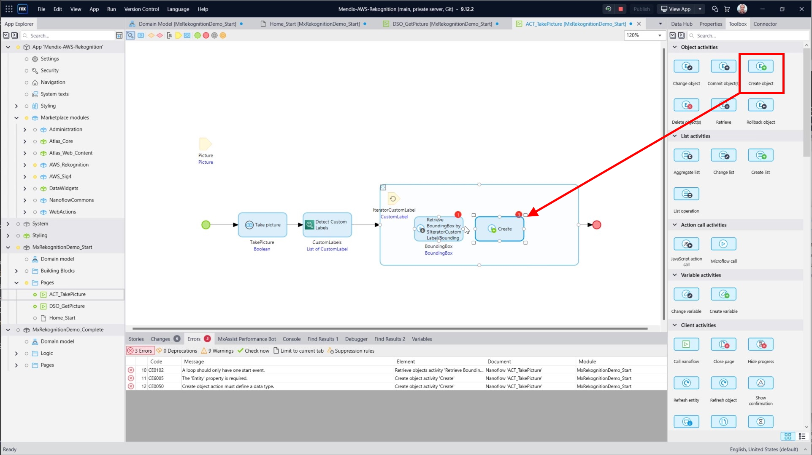

13. Configure the activity by selecting the Entity "Label".
14. Set 3 Members to the following:
    - Label_Picture = $Picture
    - Confidence = $IteratorCustomLabel/Confidence
    - Name = $IteratorCustomLabel/Name
  
15. Make sure to Commit the Label Object by checking the "Commit" Checkbox


15. Finally add a bounding box activity and configure as follows:
    - Class name = 'img-container'
    - Bounding box = $BoundingBox
    - Custom label = $IteratorCustomLabel
    - High Confidence Threshold = 80
    - Medium Confidence Threshold = 50

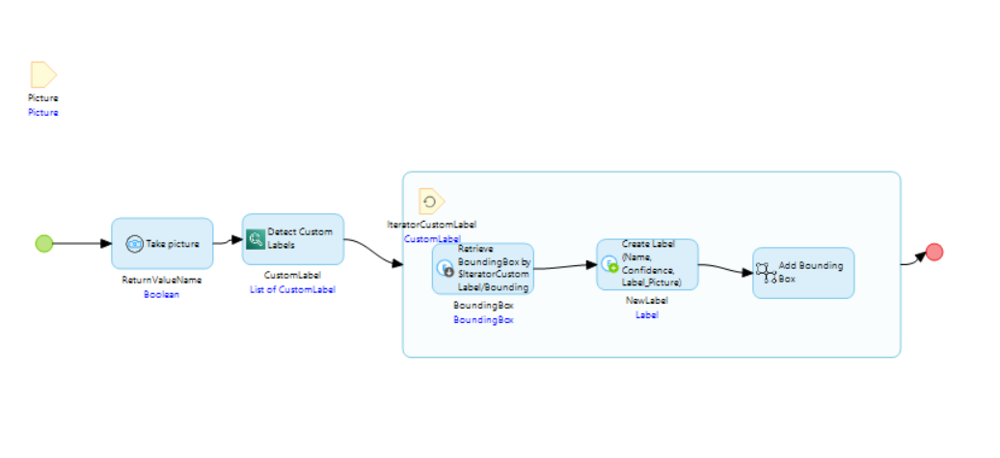


16. We are now complete so we need to run the project in the cloud. Click the **Publish** button on the top right.

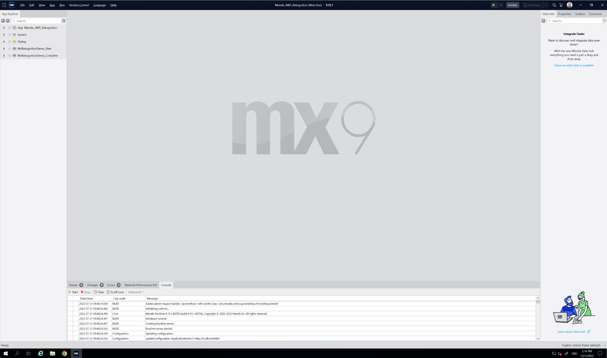

17. You will then see a message informing you that the deployment is in process.

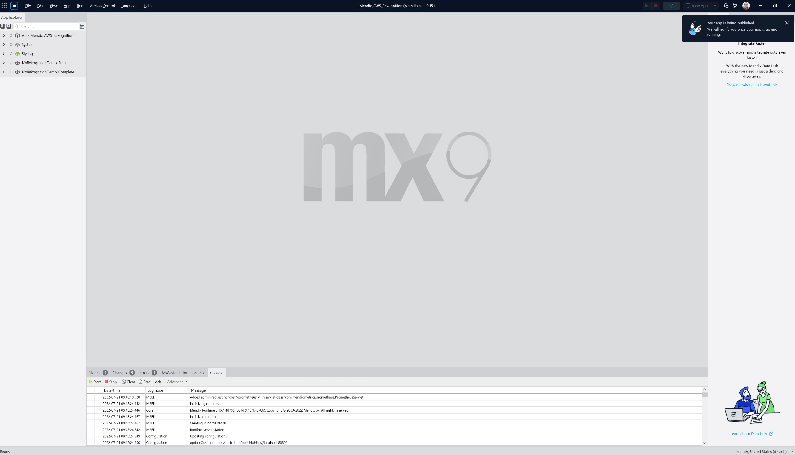

18. Click the dropdown near the view app and select view on device.

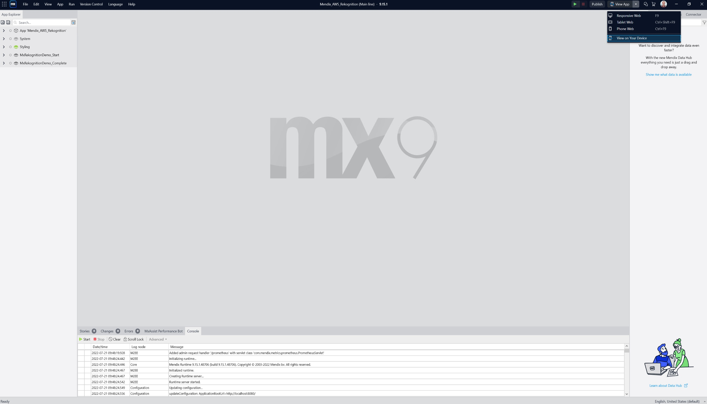

19. A QR code will be generated and displayed. Scan this with your mobile phone.

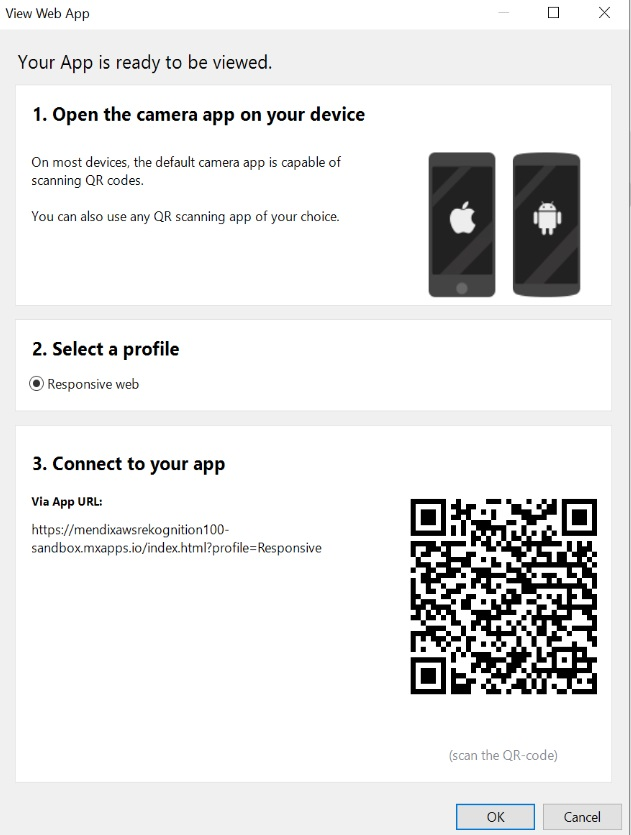

20. Congratulations you can now use your newly built app!

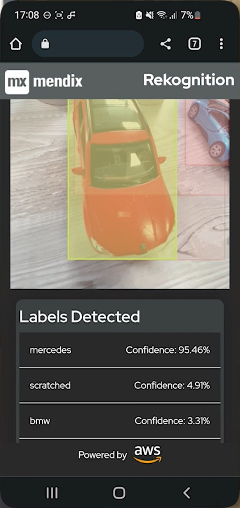


If you're streaking ahead, you can always try out the bonus activity

# Bonus 1

## Change your app and use it to detect celebrity faces!

You will need to do a few things:
1. Train a new model with some celebrity faces
2. Update the Nanoflow "TakePicture" to use your new model
3. If you want, update your UI to tell the User which Celebrity is in the picture


# Bonus 2

## Publish messages using AWS IoT Core & MQTT

With Mendix you can also very easily connect your IoT devices using AWS's IoT Core, this set of steps will help you to publish and subscribe to IoT devices using the MQTT protocol

### Setup your IoT Core thing

1. Setup an MQTT thing in [IoT Core](https://console.aws.amazon.com/iot/home)


2. Select a Single thing
   


1. Enter the name


2. We recommend "Auto-generate a new certificate"


3. Attach a policy

We'll assume you do not have a Policy in place, so for this build you can just use an "Allow all" policy (This is to keep things simple but is NOT recommended for production)

You can enter the Policy in JSON from as below:

```
{
  "Version": "2012-10-17",
  "Statement": [
    {
      "Effect": "Allow",
      "Action": "iot:*",
      "Resource": "*"
    }
  ]
}
```

If you are wanting to use this in a more secure way, you can use the below format for your policy. See more about IoT Core Policies [here](https://docs.aws.amazon.com/iot/latest/developerguide/iot-policies.html)

Make sure to replace **<INSERT_REGION>** with your region e.g. **eu-central-1**

Make sure to replace **<INSERT_ACCOUNT_ID>** with your account id e.g. **999999999999**

```
{
  "Version": "2012-10-17",
  "Statement": [
    {
      "Effect": "Allow",
      "Action": "iot:Connect",
      "Resource": "arn:aws:iot:<INSERT_REGION>:<INSERT_ACCOUNT_ID>:*"
    },
    {
      "Effect": "Allow",
      "Action": "iot:Publish",
      "Resource": "arn:aws:iot:<INSERT_REGION>:<INSERT_ACCOUNT_ID>:*"
    },
    {
      "Effect": "Allow",
      "Action": "iot:Receive",
      "Resource": "arn:aws:iot:<INSERT_REGION>:<INSERT_ACCOUNT_ID>:*"
    },
    {
      "Effect": "Deny",
      "Action": "iot:GetRetainedMessage",
      "Resource": "arn:aws:iot:<INSERT_REGION>:<INSERT_ACCOUNT_ID>:*"
    },
    {
      "Effect": "Deny",
      "Action": "iot:ListRetainedMessages",
      "Resource": "arn:aws:iot:<INSERT_REGION>:<INSERT_ACCOUNT_ID>:*"
    },
    {
      "Effect": "Allow",
      "Action": "iot:RetainPublish",
      "Resource": "arn:aws:iot:<INSERT_REGION>:<INSERT_ACCOUNT_ID>:*"
    },
    {
      "Effect": "Allow",
      "Action": "iot:Subscribe",
      "Resource": "arn:aws:iot:<INSERT_REGION>:<INSERT_ACCOUNT_ID>:*"
    },
    {
      "Effect": "Deny",
      "Action": "iot:DeleteThingShadow",
      "Resource": "arn:aws:iot:<INSERT_REGION>:<INSERT_ACCOUNT_ID>:*"
    },
    {
      "Effect": "Deny",
      "Action": "iot:GetThingShadow",
      "Resource": "arn:aws:iot:<INSERT_REGION>:<INSERT_ACCOUNT_ID>:*"
    },
    {
      "Effect": "Deny",
      "Action": "iot:UpdateThingShadow",
      "Resource": "arn:aws:iot:<INSERT_REGION>:<INSERT_ACCOUNT_ID>:*"
    },
    {
      "Effect": "Deny",
      "Action": "iot:UpdateThingShadow",
      "Resource": "arn:aws:iot:<INSERT_REGION>:<INSERT_ACCOUNT_ID>:*"
    },
    {
      "Effect": "Deny",
      "Action": "iot:DescribeJobExecution",
      "Resource": "arn:aws:iot:<INSERT_REGION>:<INSERT_ACCOUNT_ID>:*"
    },
    {
      "Effect": "Deny",
      "Action": "iot:GetPendingJobExecutions",
      "Resource": "arn:aws:iot:<INSERT_REGION>:<INSERT_ACCOUNT_ID>:*"
    },
    {
      "Effect": "Deny",
      "Action": "iot:UpdateJobExecution",
      "Resource": "arn:aws:iot:<INSERT_REGION>:<INSERT_ACCOUNT_ID>:*"
    },
    {
      "Effect": "Deny",
      "Action": "iot:StartNextPendingJobExecution",
      "Resource": "arn:aws:iot:<INSERT_REGION>:<INSERT_ACCOUNT_ID>:*"
    }
  ]
}
```

4. Create thing & Download Certs

Your thing will now be created. **Make sure to download all of the required certificate & key files**


### Build for Publishing messages

1. To explore the Mendix Marketplace and download the MQTT Connector


4. Connect the MQTT Config page provided up to the **Navigation**  

The Navigation inside Mendix Studio Pro allows you to configure a Navigation/Menu system for your users inside the application


You can now RUN your Mendix App using the Play icon


5. Configure your MQTT using the device information you created in **IoT Core**


6. Create an Entity in the Domain model that is NON-PERSISTENT Called **Comment** 
7. Add an attribute to that entity that can store a String attribute **Message**
8.  Create a DSO Nanoflow like we did in the Rekognition project that CREATES and RETURNS an instance of the **Comment** Entity
9. Place a **Data View** on the **Home_IoT_Start** start page and select the new DSO (Data Source) Nanoflow as the data source
10. Add a text box widget from the **Toolbox** that can help capture the message attribute
11. Add a **Microflow** button inside the **Data View** in order to send the message
12. Behind the Microflow button, create a new Microflowm to send the message
13. In the Microflow, drag on a **Retrieve** activity from the **Toolbox** the IoT Config From the database


14. Now drag on a **Export with mapping** activity from the **Toolbox**
15. In this Export activity, Select a mapping, and click on **New** to create a new one


16. Open the new mapping, click on **Select Elements** at the top
17. Select **JSON Structure**
18. Click **Select** and create a new JSON mapping
19. Enter the following simple JSON structure

```
{
	"Message": "Hello World!"
}
```
20. Click Refresh and OK
21. Inside the mapping you can automatically map your Mendix **Comment** Entity to the JSON structure by selecting, **Map Automatically** at the top
22. Once the mapping is done, inside your Microflow, in the Export mapping activity, select your Comment object as a Paramenter and click OK
23. Select the output for the export mapping to be a String
24. Use the **Toolbox** to drag on the **Publish MQTT** activity
25. Fill in the details of the MQTT, use the topic:
```
things/comments
```
26. Use the Output JSON String from the export as the **Payload**
27. Select QoS as "At least once"
28. Set Retained to true

Your Microflow should be complete, you can run the project locally by using the **Green** run button at the top (left of the publish button)

You should be able to log into the AWS IoT Core console, and subscribe to your topic to test the messages

### Test your publishing

### Build for Subscribe

### Test Subscribe


# Clean up

## Amazon Rekogniton Clean up


1. Open Amazon Rekognition Console.  Select a region where you built a project on the top.
2.  Select Custom Labels from the menu on the left side and choose Project.


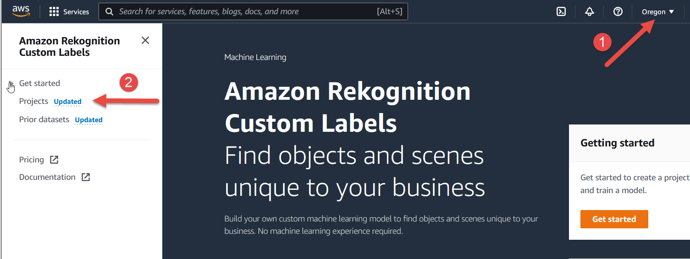

3. Under models, click on the  hyperlink of the model name.

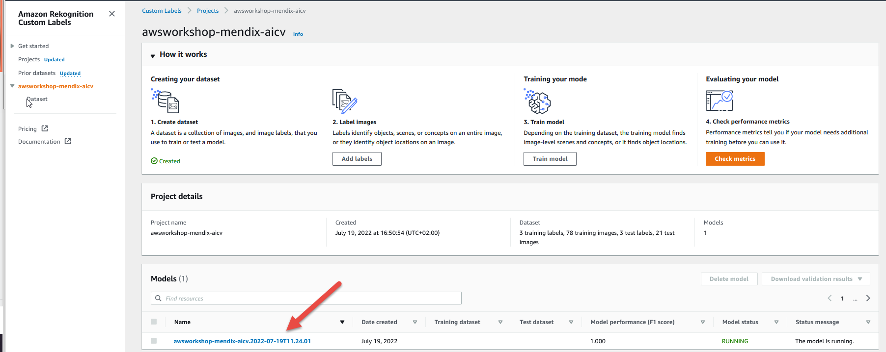

4. Click on the Use model tab. Click **Stop**.

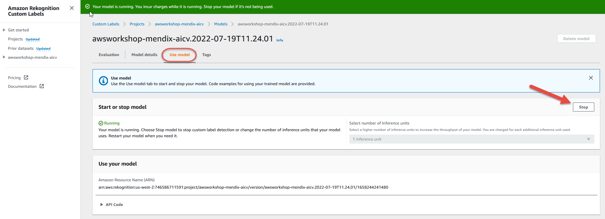

5. In the popup window, type *stop*. Wait for a model to be  stopped. 

6. Once the model is stopped, go back to the project. Select a model with a checkbox and click **Delete model** button.

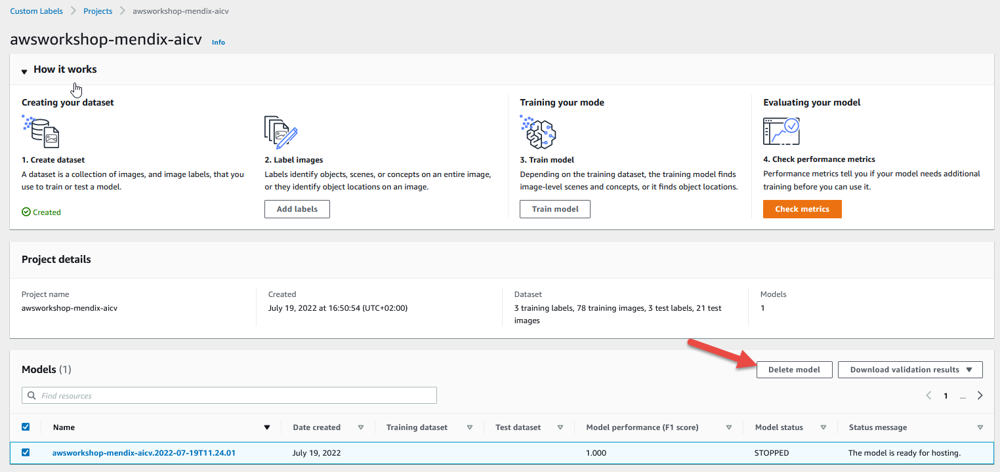

7. In the popup window, type *delete*. Wait for a model to be  stopped. 

## Amazon S3 Clean up

1. Open AWS Console for Amazon S3. Select a bucket that contains an image dataset. Click on **Empty** button at the top.

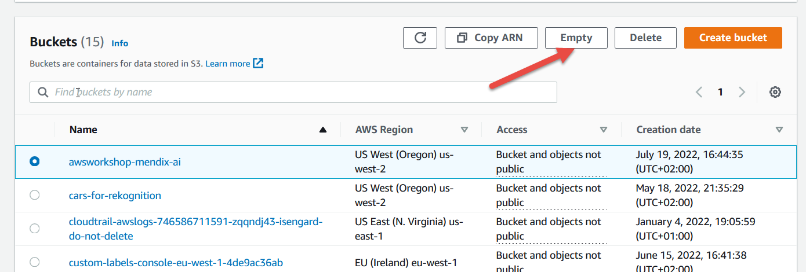

2. In the new window type *permanently delete* to delete objects in the bucket.

3. Once bucket will be emptied, go back to Amazon S3 bucket list and select your bucket. Click on **Delete** button at the top.

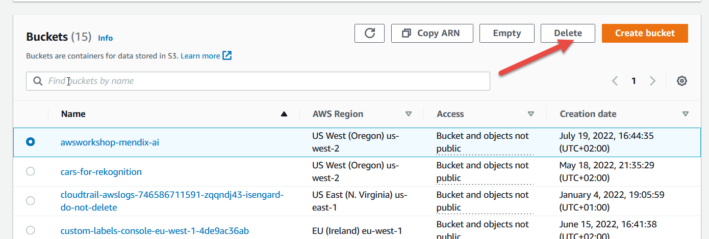

## Amazon EC2 Clean up

1. Open EC2 Console. Select *Frankfurt* region at the top. Click on *Instances (running)*

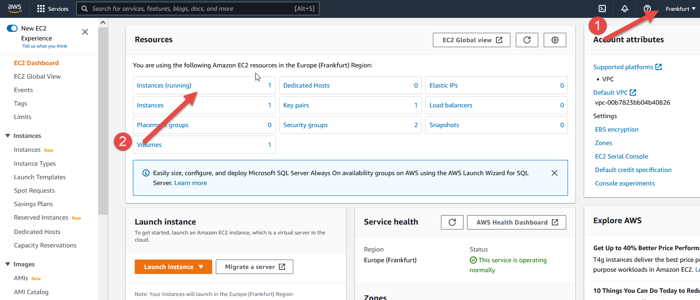

2. Select your instance from the list. Expand *Instance state* dropdown at the top and click **Terminate instance**

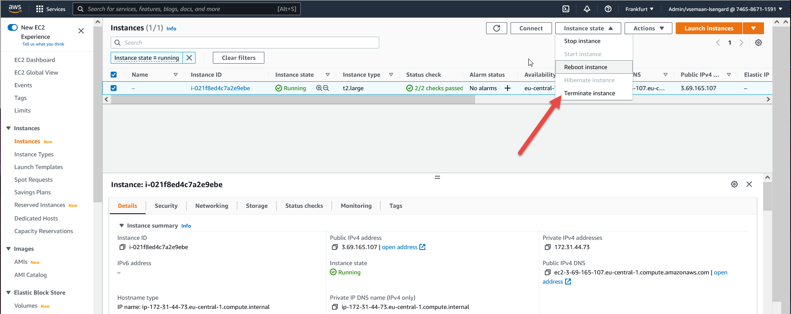

3. In the popup window, confirm **Terminate**

# Frequently Asked Questions (FAQ)

See our [FAQ](FAQ.md) section

# Troubleshooting

See our [Troubleshooting secion in the FAQ page](FAQ.md#feedback) section

# Your feedback

If you have a question that is NOT answered below, or if you have other feedback regarding the workshop, please feel free to get in touch with us [here](https://mendix.com)